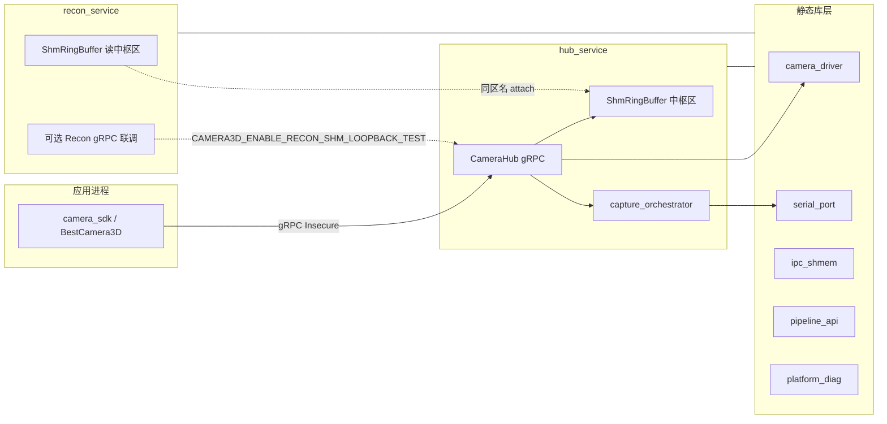

# camera_3d_stack 工程总览

面向 **3D 相机投采 + Hub 中枢 + 共享内存 + 重建联调** 的 C++17 单体仓库：应用通过 **camera_sdk** 连 **hub_service**；大块图像/深度元数据走 **Boost.Interprocess 共享内存**；**recon_service** 为算法侧进程占位（可选 gRPC 回环联调）。根 **CMakeLists.txt** 已对 MSVC 启用 **`/utf-8`**，源码中文注释按 UTF-8 保存即可与编译一致。

更细的 Hub↔重建 SHM 时序见 **`README_hub_recon_grpc_shm.md`**。

---

## 1. 逻辑架构（谁在调谁）

**控制面**：Protobuf/gRPC（`proto/camera_hub.proto` 等），`reply.status.code` 与 **`libs/camera_hub_api/include/camera3d/hub/hub_service_state_codes.h`** 对齐。  
**数据面**：`ShmFrameRef`（区名 + `seq` + offset/size）指向 **同一块共享内存** 中的槽位；消费者 `CreateOrOpen` 同一 `region_name` 后按 `seq` 对齐代际。

---

## 2. 目录与构建产物（大类）

| 路径 | 角色 | 技术要点 |
|------|------|----------|
| **`proto/`** | 契约 | `camera_hub.proto`：Connect / Capture / **SetParameters / GetParameters**（`HubParameterType`：2D 曝光/增益/伽马）/ GetDepth / …；大块数据只传 SHM 元数据。 |
| **`libs/platform_diag`** | 日志与崩溃 | spdlog 初始化、`CAMERA3D_LOG*` 宏；可选 Breakpad，缺省时 Windows MiniDump。 |
| **`libs/camera_hub_api`** | Hub 公共头 | 状态码枚举与中文简述，供 Hub 与 SDK 同路径包含。 |
| **`libs/camera_driver`** | 相机抽象 | `ICameraAdapter` + `CameraManager`（曝光/增益/伽马读写等）；`null` / `daheng` 等适配器可条件编译。 |
| **`libs/serial_port`** | 投影仪串口 | `SerialPortManager` 单例、`ProductionCommand` 与现场投采脚本对齐。 |
| **`libs/capture_orchestrator`** | 投采编排 | Hub 主路径仅用 `SendProductionCommandOnly`；硬触发与结果回调由 `CameraManager`（注册回调后 `StartStreamGrab`）完成。 |
| **`libs/ipc_shmem`** | SHM | `ShmRingBuffer` 环形槽 + `ShmSlotHeader`；常量见 `shm_constants.h`。 |
| **`libs/pipeline_api`** | 算法占位接口 | `IReconstructionPipeline` / `IDetectionPipeline` + `ShmFrameView`；重建进程可逐步替换实现。 |
| **`libs/camera_proto` / `camera_proto_stub`** | 生成代码 | 无 gRPC 三方时 **`CAMERA3D_USE_GRPC_STUB=ON`**，Hub/SDK 用桩链接。 |
| **`services/hub_service`** | 中枢进程 | `RunHubApp`：读 JSON、统一启动（相机+串口+SHM+编排）、gRPC 服务实现。 |
| **`services/recon_service`** | 重建进程 | 默认可仅心跳；非 stub 时后台 **gRPC 轮询 GetDepth**，将 `camera_raw_frames` 从 SHM 落盘到 `recon_img_save/`；开启宏时另有 **SHM+gRPC 回环** 验证通路。 |
| **`sdk/camera_sdk`** | 上层 SDK | `IUserCameraSdk` / `BestCamera3D`；`hub_client_action.h` 映射 Hub 业务码与建议动作。 |
| **`tools/*`** | 冒烟/连通性 | 依赖安装后的 `camera_sdk` / Hub 等。 |
| **`cmake/`** | 工程化 | 运行期 DLL 拷贝等。 |

---

## 3. 典型运行流程（简）

1. **启动 Hub**：`hub_service.exe`，默认读 `config/hub_service.json`（或环境变量 **`CAMERA3D_HUB_CONFIG`**），监听 `listen`（如 `0.0.0.0:50051`）。统一启动成功后内部状态为 **Ready**；失败时仍监听，**Connect** 返回对应 **`HubServiceStateCode`**。
2. **应用 Connect**：SDK 建 gRPC 通道，`Connect` 拿到 `session_id`（会话与编排绑定）。串口已打开时 Hub 会下发 **`SetCommand::kExitBlackToTest`**（退出黑屏进入测试画面）；**`Disconnect`** 匹配会话时会先下发 **`SetCommand::kBlackScreen`**（黑屏）再释放编排。
3. **Capture**：仅发送投影仪串口硬触发指令，帧由 Hub 初始化时注册的相机回调异步写入 **Hub SHM**；每路相机收满 **`capture.frames_per_hardware_trigger`** 张（默认 24）后本采集才完成。`GetDepth` 按 `client_capture_id` 返回 `ShmFrameRef` 与 **`camera_raw_frames`**（多路×多帧，含 `burst_frame_index`）。若串口未连通则 `Capture` 直接返回错误，不再在 RPC 内调用 `GrabOne`。**`with_detection_pipeline` 在 Hub 侧已忽略**；**`with_reconstruction_pipeline`** 仍为 SHM 上 **final 槽占位**。
4. **重建侧**：`recon_service` 仍打开 Hub ring 做占位重建心跳；若为非 stub 构建，另起线程用 **`CAMERA3D_HUB_GRPC`**（默认 `127.0.0.1:50051`）`Connect` 后轮询 **`GetDepth(client_capture_id=0)`**，在出现新的 `client_capture_id` 且 **`camera_raw_frames` 非空**时，按各帧 `ShmFrameRef` 从 SHM 读出并写入 **`recon_img_save/<时间戳>/`**（根目录可用 **`CAMERA3D_RECON_BURST_SAVE_ROOT`** 覆盖；轮询间隔 **`CAMERA3D_RECON_BURST_POLL_MS`**（默认 250）；**`CAMERA3D_RECON_DISABLE_BURST_SAVE=1`** 关闭该线程）。联调回环见 `README_hub_recon_grpc_shm.md`。

---

## 4. 交互技术要点（易错）

- **gRPC**：默认 **Insecure**；stub 模式下无真实监听，仅便于编过相机/诊断代码。
- **SHM**：`TryWriteNextSlot` / `TryReadSlot`；**`seq`** 用于判断新帧；多进程需约定 **`kDefaultHubRingRegionName`** 与容量（默认中枢 ring **512MB** / **64** 槽，单槽约 8MB 级负载，避免单次 burst 多写覆盖同槽导致多 `ShmFrameRef` 读到错误帧；Hub 首次 `create` 会重建区名对应文件）。
- **Hub 相机配置**：`hub_service.json` 的每路 `camera` 以 `serial_number` 为唯一标识，`ip` 用于连接；不再需要 `device_id` 字段。可选 **`capture.frames_per_hardware_trigger`**（默认 24）控制单次硬触发每路回调帧数。
- **投影仪串口握手**：发命令后先收 `EB 90 00 AA XX 00`（`XX` 与下行第 5 字节一致）校验“已收到”；投采命令还需再收 `EB 90 00 55 YY 00` 表示“播放完成”。
- **大恒 Galaxy 取流**：须在 **StartGrab 之前** 注册 `RegisterCaptureCallback`；Hub 硬触发路径为 **Open（仅开流）→ `SetTriggerMode` → `SetResultCallback` → `CameraManager::StartStreamGrab`**；`GrabOne` / `StartAsyncGrab` 会在需要时启动采集。
- **会话**：`Disconnect` 后 Hub 置 **SessionNotEstablished**，需再次 **Connect**。
- **编码**：MSVC 使用 **`/utf-8`**；注释与字符串建议统一 **UTF-8（无 BOM 即可）**。

---

## 5. 常用 CMake 选项

| 选项 | 含义 |
|------|------|
| **`CAMERA3D_USE_GRPC_STUB`** | 无 Protobuf/gRPC 时 ON：桩 proto，Hub 不启真实服务循环（见 stub `RunHubApp`）。 |
| **`CAMERA3D_ENABLE_RECON_SHM_LOOPBACK_TEST`** | Hub↔Recon SHM + gRPC 联调（需真实 gRPC + 对应源码）。 |
| **`CAMERA3D_ENABLE_CAPTURE_INLINE_IMAGE_TEST`** | Hub 从内联路径读测试图（仅联调）。 |
| **`CAMERA3D_ENABLE_HUB_ALGO_BURST_PUSH_TEST`** | Hub 采集完成后占位日志/预留推送多帧原始图给算法侧（默认关闭）。 |
| **`CAMERA3D_ENABLE_HUB_CAPTURE_BURST_TIFF_SAVE`** | Hub 每次硬触发收齐 burst 后，将原始帧写入**进程当前目录**下 `hub_img_save/<时间戳>/`（`.tiff`；需 OpenCV **core+imgcodecs**，与 `CAMERA3D_USE_GRPC_STUB` 互斥）。 |
| **`CAMERA3D_ENABLE_ADAPTER_DAHENG`** | 大恒适配器（见 `hub_service/main.cpp`）。 |

---

## 6. 代码注释约定

新增与修订的注释遵循仓库根目录 **`code-comments-skill.txt`**：中文、精简、与逻辑一致；公共 API 以「职责 + 关键参数/返回值」为主，避免复述实现细节。各库/服务入口头文件与 `.cpp` 首行补充 **@file 级** 模块说明；**实现文件**中对每个对外成员函数增加 **「实现 Class::method：…」** 式一行摘要。**Protobuf/gRPC 生成代码**（`*.pb.h` / `*.grpc.pb.h`）由工具生成，不在仓库内逐接口手写注释，以 **`proto/*.proto`** 与本文档为准。
